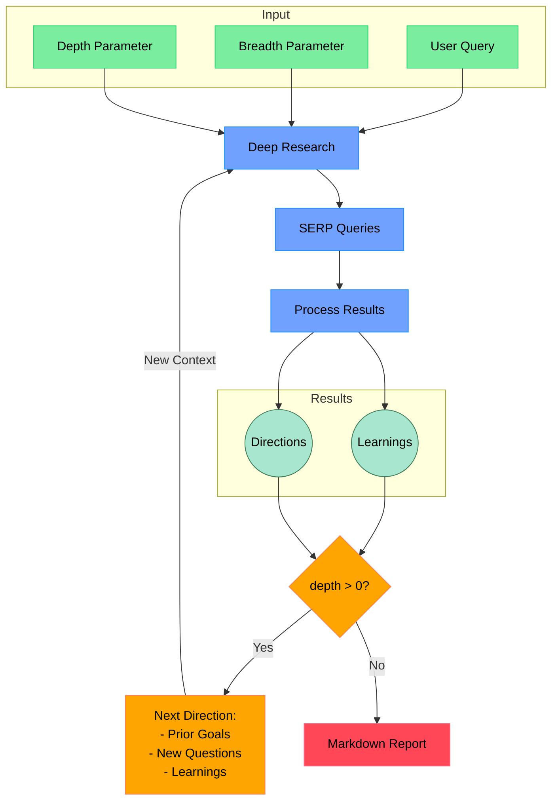

# Open Deep Research

An AI-powered research assistant that performs iterative, deep research on any topic by combining Tavily search and large language models.

The goal of this repo is to provide the simplest implementation of a deep research agent - e.g. an agent that can refine its research direction over time and deep dive into a topic. Goal is to keep the repo size at <500 LoC so it is easy to understand and build on top of.

If you like this project, please consider starring it and giving me a follow on [X/Twitter](https://x.com/dzhng). This project is created by [Duet](https://duet.so).

## How It Works



## Features

- **Iterative Research**: Performs deep research by iteratively generating search queries, processing results, and diving deeper based on findings
- **Intelligent Query Generation**: Uses LLMs to generate targeted search queries based on research goals and previous findings
- **Depth & Breadth Control**: Configurable parameters to control how wide (breadth) and deep (depth) the research goes
- **Smart Follow-up**: Generates follow-up questions to better understand research needs
- **Comprehensive Reports**: Produces detailed markdown reports with findings and sources
- **Concurrent Processing**: Handles multiple searches and result processing in parallel for efficiency
- **Web UI**: Next.js app with streaming research progress and markdown reports (`npm run dev:web`)

## Requirements

- Node.js environment
- API keys for:
  - [Tavily](https://tavily.com/) API (for web search)
  - [OpenRouter](https://openrouter.ai/) API (recommended LLM) or OpenAI / Fireworks

## Setup

### Node.js

1. Clone the repository
2. Install dependencies:

```bash
npm install
```

3. Copy `.env.example` to `.env` (or `.env.local`) and set your API keys:

```bash
cp .env.example .env
```

`npm start` loads `.env` first, then `.env.local` (local overrides). Put real keys in at least one of these files — do not leave placeholder values in `.env.local` if that file exists.

Recommended setup (OpenRouter + Tavily):

```bash
TAVILY_API_KEY="tvly-your_api_key"
OPENROUTER_API_KEY="sk-or-v1-your_api_key"
OPENROUTER_MODEL="google/gemini-2.5-flash-preview"
```

Alternatively, use any OpenAI-compatible endpoint:

```bash
TAVILY_API_KEY="tvly-your_api_key"
OPENAI_KEY="your_api_key"
OPENAI_ENDPOINT="https://openrouter.ai/api/v1"
CUSTOM_MODEL="google/gemini-2.5-flash-preview"
```

For a local LLM server, set `OPENAI_ENDPOINT` (e.g. `http://localhost:1234/v1`) and `CUSTOM_MODEL` to your loaded model name.

### Docker

1. Clone the repository
2. Rename `.env.example` to `.env.local` and set your API keys
3. Build and start the web app:

```bash
docker compose up -d --build
```

4. Open [http://localhost:3000](http://localhost:3000)

For the interactive CLI inside the container:

```bash
docker exec -it deep-research npm start
```

For the legacy Express JSON API on port 3051:

```bash
docker exec -it deep-research npm run api
```

If you run behind nginx or another reverse proxy, set **proxy read timeout to at least 10–15 minutes** — deep research requests can run for a long time.

## Usage

### Web (recommended)

Development:

```bash
npm run dev:web
```

Open [http://localhost:3000](http://localhost:3000). The UI walks through follow-up questions (report mode), shows live research progress, streams the final markdown report, and lets you copy or download the result.

Production build:

```bash
npm run build:web
npm run start:web
```

### CLI

Run the research assistant:

```bash
npm start
```

You'll be prompted to:

1. Enter your research query
2. Specify research breadth (recommended: 3-10, default: 4)
3. Specify research depth (recommended: 1-5, default: 2)
4. Answer follow-up questions to refine the research direction

The system will then:

1. Generate and execute search queries
2. Process and analyze search results
3. Recursively explore deeper based on findings
4. Generate a comprehensive markdown report

The final report will be saved as `report.md` or `answer.md` in your working directory, depending on which modes you selected.

### HTTP API (Express)

```bash
npm run api
```

- `POST /api/research` — short answer mode (JSON)
- `POST /api/generate-report` — full markdown report (JSON)

Default port: `3051` (override with `PORT`).

### Concurrency

Increase parallel search requests with `SEARCH_CONCURRENCY` (default: 2). Lower it to `1` if you hit Tavily rate limits.

### DeepSeek R1

Deep research performs great on R1! We use [Fireworks](http://fireworks.ai) as the main provider for the R1 model. To use R1, simply set a Fireworks API key:

```bash
FIREWORKS_KEY="api_key"
```

The system will automatically switch over to use R1 instead of `o3-mini` when the key is detected.

### OpenRouter

Set `OPENROUTER_API_KEY` and `OPENROUTER_MODEL` (alias: `CUSTOM_MODEL`). The client automatically uses `https://openrouter.ai/api/v1` and sends OpenRouter-recommended headers.

The same model can be served by multiple backends on OpenRouter (different quality, price, and quantization). Use provider routing env vars to pick a backend:

```bash
# Prefer these provider slugs, in order (copy slug from the model page on OpenRouter)
OPENROUTER_PROVIDER="deepinfra,together"

# Or restrict to only these providers
# OPENROUTER_PROVIDER_ONLY="deepinfra"

# Skip providers you do not want (e.g. a low-quality fp8 host)
# OPENROUTER_PROVIDER_IGNORE="some-provider"

# Prefer higher-precision quantizations (avoids fp8 when you set fp16/bf16)
OPENROUTER_QUANTIZATIONS="fp16,bf16"

# Set to false to disable fallback to other providers when yours are unavailable
# OPENROUTER_ALLOW_FALLBACKS=false
```

OpenRouter models use tool/JSON mode instead of strict `json_schema` (better compatibility with models like `openai/gpt-oss-120b`). For best results, prefer models with strong instruction-following (e.g. `google/gemini-2.5-flash-preview`, `anthropic/claude-3.5-sonnet`). Set `STRUCTURED_OUTPUTS=true` only if your model supports OpenAI-style JSON schema.

## How It Works

1. **Initial Setup**

   - Takes user query and research parameters (breadth & depth)
   - Generates follow-up questions to understand research needs better

2. **Deep Research Process**

   - Generates multiple SERP queries based on research goals
   - Processes search results to extract key learnings
   - Generates follow-up research directions

3. **Recursive Exploration**

   - If depth > 0, takes new research directions and continues exploration
   - Each iteration builds on previous learnings
   - Maintains context of research goals and findings

4. **Report Generation**
   - Compiles all findings into a comprehensive markdown report
   - Includes all sources and references
   - Organizes information in a clear, readable format
  
## Community implementations

**Python**: https://github.com/Finance-LLMs/deep-research-python

## License

MIT License - feel free to use and modify as needed.
