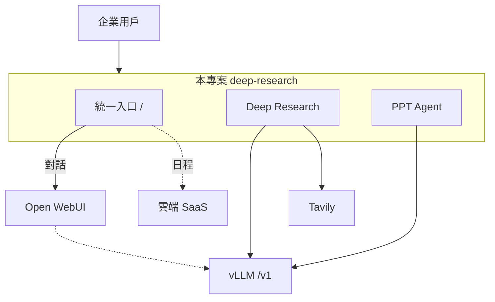

# 地平線國際合資有限公司 — 本地部署 AI Workspace 技術文檔

> **專案代稱**：SP Intelligence（可透過環境變數自訂顯示名稱）  
> **客戶**：地平線國際合資有限公司  
> **部署模式**：企業內網本地部署（On-Premises）  
> **程式庫基礎**：Open Deep Research（Next.js 15 + Node.js 22）

---

## 1. 文檔目的與讀者

本文檔說明本 AI Workspace 的系統定位、功能邊界、與外部服務的整合方式、部署架構及運維配置，供：

- 資訊部門進行本地部署與網路規劃  
- 開發與維運人員理解模組劃分與 API  
- 業務方了解各入口對應的實際能力（本地 vs 雲端）

---

## 2. 系統概述

本系統為**統一入口型 AI 工作台**：在企業內網提供一致的 Web 介面，將不同類型的工作分流到合適的後端：

| 能力類型 | 處理位置 | 說明 |
|---------|---------|------|
| 日常對話、語音、多模態聊天 | **Open WebUI**（可內網或專用網域） | 首頁輸入後以 URL 參數跳轉，不在本應用內實作聊天引擎 |
| 深度研究、報告生成 | **本應用** `/research` | 迭代式網路搜尋 + LLM 綜合，需 Tavily + 本地/相容 LLM |
| 簡報生成 | **本應用** `/ppt` | 大綱編輯 → LangGraph 規劃 → PPTX 匯出 |
| 日程管理 | **雲端 SaaS 平台**（規劃整合） | 工作台僅作入口導向，資料與排程邏輯在 SaaS |
| 模型推理（研究/PPT） | **本地 vLLM** 或 OpenAI 相容端點 | 透過 `OPENAI_ENDPOINT` 對接 vLLM 的 `/v1` API |

設計原則：**敏感對話與高頻聊天走 Open WebUI + 本地模型；結構化研究與簡報在本應用完成；協作日程走已採購的雲端 SaaS。**

---

## 3. 整體項目架構

完整架構圖（系統全景、部署拓撲、分層架構、前後端模組、三大資料流、LangGraph 狀態機）請見：

**→ [`docs/架構圖.md`](./架構圖.md)**

### 3.1 系統全景（摘要）



### 3.2 邏輯整合（摘要）

| 流向 | 說明 |
|------|------|
| 首頁 Enter / 側欄新對話 | → Open WebUI（`OPENWEBUI_URL` + `?q=`） |
| `/research`、`/ppt` | → 本應用 API → `src/*` → vLLM |
| Deep Research 搜尋 | → Tavily（出站） |
| 日程管理 | → 雲端 SaaS（入口規劃中） |

### 3.3 技術棧

| 層級 | 技術 |
|------|------|
| 前端 | React 19、Next.js App Router、自訂 CSS（Open WebUI 風格首頁） |
| 後端 API | Next.js Route Handlers（`app/api/*`） |
| 研究引擎 | `src/deep-research.ts`、Vercel AI SDK、`@ai-sdk/openai` |
| PPT 流程 | LangGraph（`@langchain/langgraph`）、Zod schema、PptxGenJS / 可選 Python |
| CLI / 舊版 API | `tsx` + Express（`src/api.ts`，預設埠 3051） |
| 容器 | Docker（Node 22 + Chromium + Python3，供 PDF/PPT 技能） |

---

## 4. 功能模組

### 4.1 首頁 — 統一提示詞入口（`/`）

- **UI**：仿 Open WebUI 的輕量首頁，中央提示詞輸入框。  
- **預設行為**：使用者按 Enter 或送出後，**整頁跳轉至 Open WebUI**，並帶上官方支援的 `?q=` 參數（自動送出首則訊息）。  
- **語音模式**：可帶 `call=true` 等 URL 參數啟動 Open WebUI 對應能力。  
- **功能捷徑卡片**：  
  - **Deep Research** → `/research`（可帶 `q` 查詢參數）  
  - **生成 PPT** → `/ppt`  
  - **會議摘要**、**日程管理** → 目前 UI 為「即將推出」；日程管理依需求應**導向雲端 SaaS**（見 §5.3）。

相關實作：`app/page.tsx`、`app/lib/openwebui.ts`。

### 4.2 對話 — Open WebUI 整合（Scheme A：跳轉）

本應用**不托管聊天會話**，採用 **URL 跳轉（Scheme A）**：

1. 瀏覽器請求 `GET /api/app-config` 取得執行期 `openWebUIUrl`。  
2. 前端組裝 `{OPENWEBUI_URL}/?q=...&model=...` 等參數。  
3. `window.location.replace` 前往 Open WebUI。

**優點**：無需 Open WebUI API Key、改 URL 只需重啟服務（無需重新 build，若使用 `OPENWEBUI_URL` 而非僅 `NEXT_PUBLIC_*`）。

**防呆**：若 `OPENWEBUI_URL` 誤設為本應用網址，會提示使用者修正環境變數。

參考：[Open WebUI URL 參數文檔](https://docs.openwebui.com/features/chat-conversations/chat-features/url-params)

側欄「新對話」「搜尋／聊天」在非研究/PPT 路由下同樣呼叫 `navigateToOpenWebUI()`（`app/components/app-nav-rail.tsx`）。

### 4.3 Deep Research — 深度研究（`/research`）

**流程概要**：

1. 使用者輸入主題，可設定 **breadth（廣度）**、**depth（深度）**。  
2. LLM 產生追問以釐清需求。  
3. 迭代：產生 SERP 查詢 → **Tavily** 搜尋 → 萃取 learnings → 決定是否加深一層。  
4. 輸出 **Markdown 報告** 或簡短答案，支援串流進度與匯出（Word/PDF）。

**API**：`POST /api/research`（Server-Sent Events / AI data stream）

**依賴**：

- `TAVILY_API_KEY`：網路搜尋（可透過 `/api/app-config` 的 `webSearchAvailable` 檢查）  
- LLM：見 §5.1 本地 vLLM

核心程式：`src/deep-research.ts`、`app/api/research/route.ts`。

### 4.4 PPT Agent — 簡報生成（`/ppt`、`/ppt/preview`）

**兩階段工作流**：

| 階段 | 說明 | API |
|------|------|-----|
| 大綱 | 串流產生可編輯大綱 | `POST /api/ppt/outline` |
| 生成 | LangGraph：規劃 deck → 驗證 → 可重試 | `POST /api/ppt/generate` |
| 預覽 | 瀏覽器內編輯投影片文字 | `GET /api/ppt/preview` |
| 匯出 | 產出可編輯 `.pptx` | `POST /api/ppt/export` |
| 下載 | 依 jobId 下載 | `GET /api/ppt/download?jobId=` |

**匯出後端**（環境變數 `PPTX_EXPORT_BACKEND`）：

- `nodejs`（預設）：PptxGenJS，程式化版面 + `templates/registry.json` 主題色  
- `python`：legacy `skills/pptx/generate.py`，可使用實體 `.pptx` 版型

**模板**：`templates/registry.json`（default / corporate / minimal 等）

圖狀態機：`src/ppt/graph/build-graph.ts`（`contentPlanner` → `validateDeckPlan` → 條件重試）。

### 4.5 日程管理 — 雲端 SaaS（規劃整合）

**業務定位**：排程、提醒、日曆協作由企業已採購的**雲端 SaaS** 承載；本工作台僅提供**單一登入入口式的導向**，不在本地保存日程資料。

**現況（程式庫）**：首頁「日程管理」卡片目前標記為「即將推出」（`app/page.tsx` 中 `href: null`）。

**建議整合方式**（與 Open WebUI 同模式）：

```bash
# 建議新增（實作時由開發加入 app-config 與首頁跳轉）
SCHEDULE_SAAS_URL="https://your-calendar-saas.example.com"
```

前端行為：點擊「日程管理」→ `window.location.href = SCHEDULE_SAAS_URL`（可選 SSO token 參數由反向代理或 IdP 統一處理）。

### 4.6 會議摘要

首頁已預留入口，尚未實作；可規劃為 Open WebUI 插件、獨立微服務，或本應用新路由。

---

## 5. 外部系統整合

### 5.1 本地 vLLM（OpenAI 相容 API）

vLLM 提供與 OpenAI Chat Completions **相容的 HTTP API**。本應用透過 `@ai-sdk/openai` 的 `baseURL` 對接，**無需改程式**即可切換到本地推理。

**典型配置**（`.env` 或 `.env.local`）：

```bash
# vLLM 預設常見位址（依實際部署調整）
OPENAI_ENDPOINT="http://<vllm-host>:8000/v1"
OPENAI_KEY="EMPTY"                    # vLLM 若未啟用鑑權可填任意非空字串
CUSTOM_MODEL="<served-model-name>"    # 與 vLLM --served-model-name 一致

# 勿同時依賴雲端 OpenRouter（除非刻意做 fallback）
# OPENROUTER_API_KEY=
```

**驗證**：

1. `curl http://<vllm-host>:8000/v1/models` 確認模型名稱。  
2. 啟動應用後開啟 `http://<app-host>:9080/api/app-config`，確認 `llmConfigured: true`、`llmModelId` 正確。  
3. 在 `/research` 或 `/ppt` 發起一次短任務，觀察 vLLM 服務日誌是否有請求。

**注意**：

- Deep Research 與 PPT 會頻繁呼叫 structured JSON / tool 模式；請選用**指令遵循能力較強**的本地模型。  
- 可設 `STRUCTURED_OUTPUTS=true` 僅當模型支援 OpenAI JSON schema。  
- OpenRouter 專用變數（`OPENROUTER_PROVIDER` 等）在純 vLLM 場景下不生效。

Provider 讀取邏輯：`src/ai/providers.ts` 中 `readLlmConfig()`。

### 5.2 Open WebUI

| 變數 | 說明 |
|------|------|
| `OPENWEBUI_URL` | **執行期** Open WebUI 根網址（Docker 推薦，改 URL 免 rebuild） |
| `NEXT_PUBLIC_OPENWEBUI_URL` | Build 時 fallback |
| `NEXT_PUBLIC_OPENWEBUI_MODEL` | 跳轉時預選模型 ID |
| `OPENWEBUI_API_KEY` | 可選；Scheme A 跳轉**不需要** |

**部署注意**：

- 若 Workspace 與 Open WebUI 共用同一網域，必須將 `OPENWEBUI_URL` 設為 **Open WebUI 實際路徑或子網域**，不可指向本應用 `:9080`。  
- 確認 `GET /api/app-config` 回傳的 `openWebUIUrl` 與預期一致。

Open WebUI 本身可再配置連線至同一 vLLM 端點，使**聊天與研究共用本地模型**（在 Open WebUI 管理介面設定，非本 repo 範圍）。

### 5.3 日程管理雲端 SaaS

- **資料駐留**：日程資料存於 SaaS 供應商，符合「本地 Workspace + 雲端協作工具」混合架構。  
- **網路**：用戶瀏覽器需能存取 SaaS URL；若需透過企業代理或 SSO，應在 **Nginx / IdP** 層統一配置。  
- **與本地邊界**：本應用不應複製日程 DB；僅保存跳轉 URL 設定。

### 5.4 Tavily（Deep Research 網搜）

```bash
TAVILY_API_KEY="tvly-..."
SEARCH_CONCURRENCY=2   # 可調低以避免限流
```

無 Tavily 時，`webSearchAvailable` 為 false，研究功能無法執行網路搜尋環節。

---

## 6. 部署架構

### 6.1 建議拓撲（地平線國際 — 本地部署）

```
                    ┌─────────────────┐
                    │  Nginx / 反向代理 │
                    │  TLS、超時 ≥15min │
                    └────────┬────────┘
                             │
         ┌───────────────────┼───────────────────┐
         ▼                   ▼                   ▼
┌────────────────┐  ┌────────────────┐  ┌────────────────┐
│ AI Workspace   │  │ Open WebUI     │  │ vLLM           │
│ :9080 Docker   │  │ 內網/專用網域   │  │ :8000 GPU 節點  │
└────────────────┘  └────────────────┘  └────────────────┘
         │
         │  HTTPS 出站（若允許）
         ▼
   Tavily API、日程 SaaS
```

**反向代理**：Deep Research 單次請求可能超過 10 分鐘，請將 `proxy_read_timeout` 設為 **600–900 秒** 以上。

### 6.2 Docker 一鍵啟動

```bash
cp .env.example .env.local
# 編輯 .env.local：OPENWEBUI_URL、vLLM、TAVILY 等

docker compose up -d --build
# 預設 http://localhost:9080
```

`docker-compose.yml` 會將 `OPENWEBUI_URL` 注入容器；LLM 與 Tavily 由 `env_file: .env.local` 載入。

映像內含：Chromium（PDF）、Python3 + `skills/pptx` 依賴（可選 Python 匯出路徑）。

### 6.3 裸機 / Node 部署

```bash
npm install
cp .env.example .env.local
# 編輯環境變數

npm run dev:web      # 開發
npm run build:web && npm run start:web   # 生產
```

環境載入順序：`.env` → `.env.local`（後者覆蓋）。

### 6.4 品牌與顯示名稱

```bash
NEXT_PUBLIC_APP_NAME="地平線 AI Workspace"   # 首頁、標題、導覽
NEXT_PUBLIC_USER_NAME=""                    # 可選，問候語個人化
```

預設產品名：`SP Intelligence`（`app/lib/app-brand.ts`）。

---

## 7. 環境變數參考

### 7.1 必填 / 強烈建議（依使用場景）

| 變數 | 場景 | 說明 |
|------|------|------|
| `OPENWEBUI_URL` | 對話入口 | Open WebUI 完整 URL |
| `OPENAI_ENDPOINT` + `OPENAI_KEY` + `CUSTOM_MODEL` | 本地 vLLM | 或改用 `OPENROUTER_*` |
| `TAVILY_API_KEY` | Deep Research | 網路搜尋 |

### 7.2 PPT 相關

| 變數 | 預設 | 說明 |
|------|------|------|
| `PPTX_EXPORT_BACKEND` | `nodejs` | `python` 啟用 skills 路徑 |
| `PPT_OUTPUT_DIR` | OS temp | 固定目錄保存 deck |
| `PPT_TEMPLATE_LAYOUTS` | `true` | Python 匯出是否用模板版面 |
| `PPT_OUTLINE_STREAM_FIRST_BYTE_MS` | 120000 | 大綱串流逾時 |
| `PPT_OUTLINE_STREAM_IDLE_MS` | 30000 | 串流閒置逾時 |

### 7.3 研究 / 匯出

| 變數 | 說明 |
|------|------|
| `SEARCH_CONCURRENCY` | Tavily 並行數 |
| `CONTEXT_SIZE` | 上下文 token 上限提示 |
| `STRUCTURED_OUTPUTS` | 是否強制 JSON schema |

完整範例見專案根目錄 `.env.example`。

---

## 8. HTTP API 一覽

### 8.1 設定與健康

| 方法 | 路徑 | 說明 |
|------|------|------|
| GET | `/api/app-config` | 執行期設定：Open WebUI URL、LLM 狀態、Tavily、PPT 輸出目錄 |
| GET | `/api/model` | 可用研究模型列表 |

**`/api/app-config` 回應範例**：

```json
{
  "openWebUIUrl": "https://ai.example.com",
  "appName": "地平線 AI Workspace",
  "webSearchAvailable": true,
  "llmConfigured": true,
  "llmProvider": "openai",
  "llmModelId": "your-local-model",
  "pptOutputDir": null
}
```

### 8.2 研究

| 方法 | 路徑 | 說明 |
|------|------|------|
| POST | `/api/research` | 串流深度研究或答案 |
| POST | `/api/export` | 報告匯出 |
| POST | `/api/export/pdf` | PDF 匯出 |
| POST | `/api/attachments/parse-pdf` | PDF 附件解析 |

### 8.3 PPT

| 方法 | 路徑 | 說明 |
|------|------|------|
| POST | `/api/ppt/outline` | 串流大綱 |
| POST | `/api/ppt/generate` | 啟動生成 job |
| GET | `/api/ppt/preview` | 預覽資料 |
| POST | `/api/ppt/export` | 匯出 PPTX |
| GET | `/api/ppt/download` | 下載檔案 |
| GET | `/api/ppt/templates` | 模板列表 |
| GET | `/api/ppt/compositions` | 版面組合目錄 |

### 8.4 舊版 Express API（選用）

```bash
npm run api   # 預設 PORT=3051
```

- `POST /api/research` — 短答案 JSON  
- `POST /api/generate-report` — 完整 Markdown 報告  

---

## 9. 目錄結構（精簡）

```
deep-research/
├── app/                    # Next.js 頁面與 API
│   ├── page.tsx            # 首頁 → Open WebUI
│   ├── research/           # Deep Research UI
│   ├── ppt/                # PPT 工作流 + preview
│   ├── api/                # Route handlers
│   ├── components/         # 共用 UI、導覽列
│   └── lib/                # openwebui、品牌、客戶端 job
├── src/
│   ├── deep-research.ts    # 研究核心迴圈
│   ├── ai/                 # LLM providers、串流報告
│   ├── ppt/                # LangGraph、匯出、schema
│   └── search.ts           # Tavily 封裝
├── skills/pptx/            # Python PPT 技能（可選）
├── templates/              # PPTX 模板與 registry.json
├── docs/                   # 本技術文檔
├── docker-compose.yml
├── Dockerfile
└── .env.example
```

---

## 10. 安全與合規建議

1. **API 金鑰**：`.env.local` 僅存於伺服器，勿提交版控；Tavily、可選 OpenRouter 為出站憑證。  
2. **vLLM**：生產環境建議啟用 API Key 或僅內網 ACL；`OPENAI_KEY` 與 vLLM 設定一致。  
3. **Open WebUI**：獨立認證與審計；本應用跳轉不傳遞敏感 token（除非日後實作 SSO 聯邦）。  
4. **日程 SaaS**：遵循供應商資料處理協議；煙草業相關內容政策由企業合規部門定義。  
5. **出站流量**：Deep Research 會存取 Tavily 及搜尋結果 URL；若內網隔離需配置 HTTP 代理白名單。  
6. **日誌**：容器 stdout、Nginx access log；PPT job 可設 `PPT_OUTPUT_DIR` 便於備份與清理。

---

## 11. 運維檢查清單

| 檢查項 | 命令 / 方式 |
|--------|-------------|
| 應用可達 | `curl -I http://localhost:9080` |
| Open WebUI URL | `curl http://localhost:9080/api/app-config \| jq .openWebUIUrl` |
| LLM 已配置 | 同上，`llmConfigured == true` |
| vLLM 存活 | `curl http://vllm:8000/v1/models` |
| Tavily | `webSearchAvailable == true` |
| PPT 匯出 | `npm run ppt:export:check` |
| 長請求代理 | Nginx `proxy_read_timeout >= 600s` |

**常見問題**：

- 首頁跳轉又回到本站 → 修正 `OPENWEBUI_URL`。  
- 研究/PPT 報「LLM API key 未載入」→ 配置 `OPENAI_KEY` 或 `OPENROUTER_API_KEY` 並重啟。  
- vLLM 超時 → 調大反向代理與 vLLM `max_model_len` / 推理批次設定。

---

## 12. 版本與授權

- **Node**：22.x（見 `package.json` `engines`）  
- **開源基底**：MIT License（Open Deep Research）  
- **客製化**：地平線國際合資有限公司本地 Workspace 功能與整合以本 repo 部署分支為準  

---

## 附錄 A：功能與路由對照表

| 使用者操作 | 路由 / 行為 | 後端 |
|-----------|------------|------|
| 首頁輸入問題 Enter | 跳轉 Open WebUI `?q=` | Open WebUI |
| 側欄「新對話」 | 同上 | Open WebUI |
| Deep Research 卡片 | `/research` | 本應用 + Tavily + vLLM |
| 生成 PPT | `/ppt` → `/ppt/preview` | 本應用 + vLLM |
| 日程管理（規劃） | 跳轉 SaaS URL | 雲端 SaaS |
| CLI 研究 | `npm start` | 本機 `src/run.ts` |

---

## 附錄 B：相關文檔

- **整體項目架構圖**：[`docs/架構圖.md`](./架構圖.md)  
- 專案 README（英文）：`/README.md`  
- PPT 模板說明：`/templates/README.md`  
- 版面組合目錄：`/src/ppt/composition/README.md`  
- Open WebUI URL 參數：https://docs.openwebui.com/features/chat-conversations/chat-features/url-params  

---

*文檔版本：2026-05-22 · 若日程 SaaS URL 或 SSO 參數已定案，請在實作 `SCHEDULE_SAAS_URL` 後更新 §4.5 與 §5.3。*
