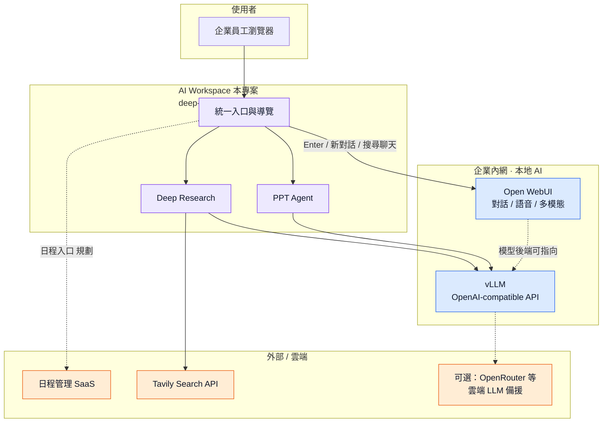
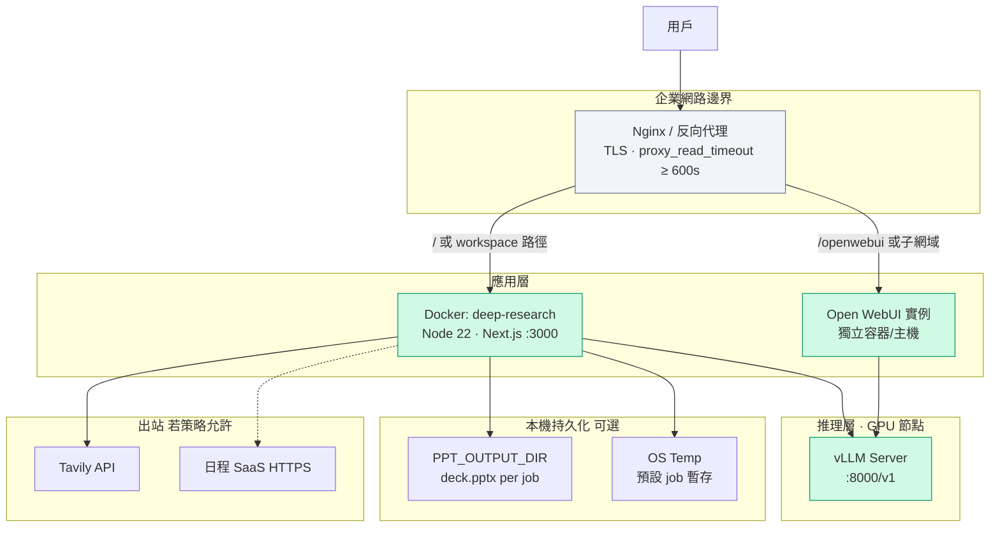
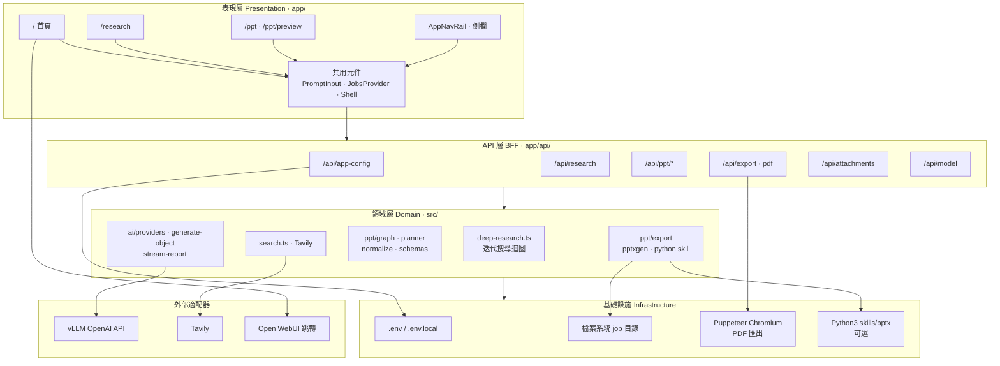
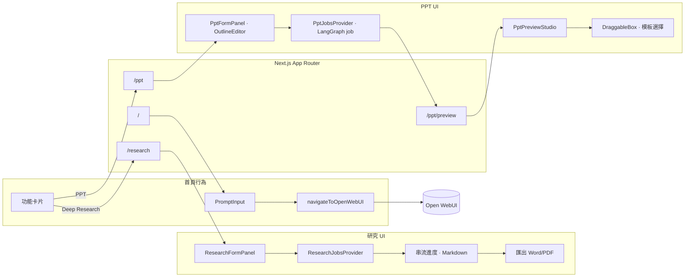
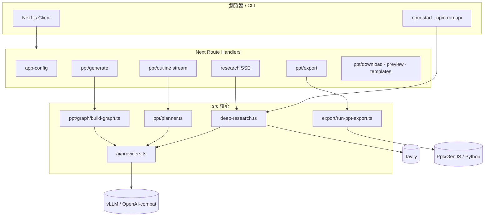
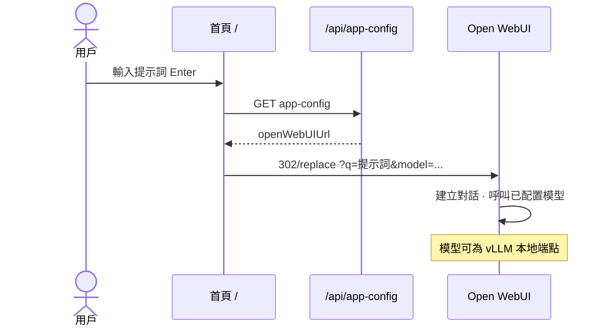
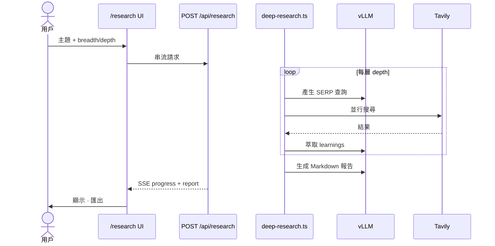
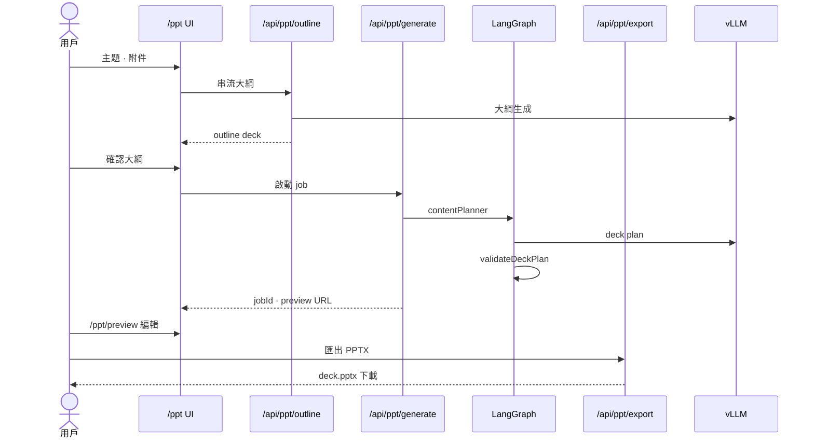
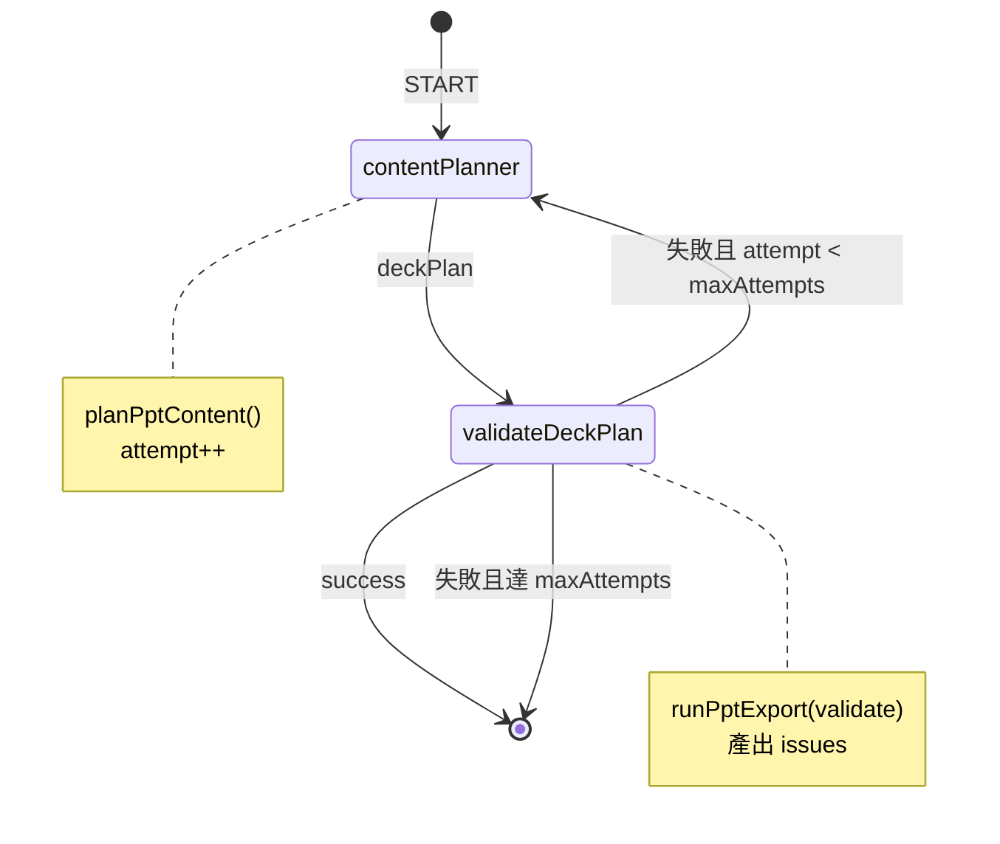
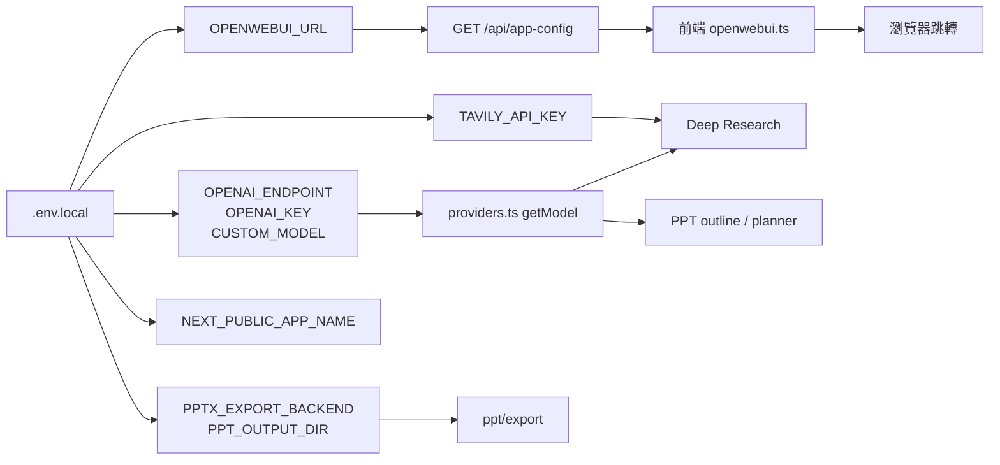

# 地平線國際合資有限公司 — AI Workspace 整體項目架構圖

> 客戶：地平線國際合資有限公司 · 部署：企業內網本地 · 產品入口：SP Intelligence / AI Workspace  
> 相關文檔：[技術文檔](./技術文檔.md)

---

## 1. 系統全景（System Context）

企業用戶透過**單一工作台入口**使用 AI 能力；對話與日程分別由專用系統承載，研究與簡報在本專案內完成。



---

## 2. 部署架構（Deployment）

建議在反向代理後部署；長時間研究請求需加大逾時。



**埠與服務對照**

| 服務 | 預設埠 | 協議 | 說明 |
|------|--------|------|------|
| AI Workspace | 3000 | HTTP(S) | `npm run start:web` / Docker |
| Open WebUI | 依部署 | HTTP(S) | 由 `OPENWEBUI_URL` 指向 |
| vLLM | 8000 | HTTP `/v1` | `OPENAI_ENDPOINT` |
| Express 舊 API | 3051 | HTTP | 選用 `npm run api` |

---

## 3. 應用分層架構（Layered Architecture）



---

## 4. 前端模組與路由（Frontend Map）



---

## 5. 後端 API 與領域模組（Backend Map）



---

## 6. 核心資料流

### 6.1 對話流（→ Open WebUI）



### 6.2 Deep Research 流



### 6.3 PPT Agent 流



---

## 7. PPT 內部狀態機（LangGraph）



---

## 8. 配置與整合關係（Configuration Hub）



---

## 9. 目錄結構總覽（Repository Map）

```
deep-research/
│
├── app/                          # Next.js 全端應用
│   ├── page.tsx                  # 首頁 → Open WebUI
│   ├── research/                 # 深度研究頁
│   ├── ppt/                      # 簡報工作流 + preview
│   ├── api/                      # HTTP API（BFF）
│   ├── components/               # UI 元件
│   └── lib/                      # 客戶端工具（openwebui, jobs, stream）
│
├── src/                          # 伺服器領域邏輯
│   ├── deep-research.ts          # 研究引擎
│   ├── ai/                       # LLM、串流、模型上下文
│   ├── ppt/                      # 簡報：graph、export、schema、planner
│   ├── search.ts                 # Tavily
│   ├── api.ts                    # Express 舊 API（可選）
│   └── run.ts                    # CLI 入口
│
├── skills/pptx/                  # Python PPT 技能（可選後端）
├── templates/                    # .pptx 模板 + registry.json
├── docs/                         # 技術文檔、本架構圖
├── docker-compose.yml
├── Dockerfile
└── .env.example
```

---

## 10. 能力邊界矩陣

| 能力 | 實作位置 | 本專案是否實作引擎 | 典型依賴 |
|------|----------|-------------------|----------|
| 日常對話 | Open WebUI | 否（僅跳轉） | `OPENWEBUI_URL` |
| 語音 / Call | Open WebUI | 否 | `?call=true` |
| 深度研究 | 本專案 `/research` | 是 | vLLM + Tavily |
| 簡報生成 | 本專案 `/ppt` | 是 | vLLM + PptxGenJS |
| 日程管理 | 雲端 SaaS | 否（入口規劃中） | SaaS URL |
| 模型推理 | vLLM（主） | 透過 OpenAI SDK 適配 | `OPENAI_ENDPOINT` |
| 報告 PDF | 本專案 | 是 | Puppeteer + Chromium |

---

## 11. 圖例說明

| 線型 | 含義 |
|------|------|
| 實線 `-->` | 已實作、主要資料路徑 |
| 虛線 `-.->` | 可選、規劃中、或依環境配置 |
| 子圖 `subgraph Local` | 企業內網可托管 |
| 子圖 `subgraph Cloud` | 需出站或雲端 SaaS |

---

*版本：2026-05-22 · 渲染：支援 Mermaid 的 Markdown 檢視器（GitHub、VS Code、Cursor 等）*
